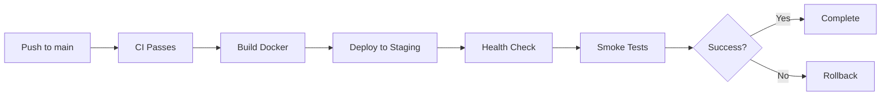
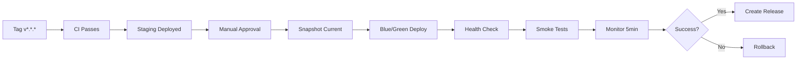

# CI/CD Pipeline Documentation

Pipeline completo de integración y despliegue continuo para Anclora WhatsApp Integration.

---

## 📋 Workflows Overview

### CI Workflow (`ci.yml`)

**Triggers:**
- Push to `main`, `develop`, `feature/**`
- Pull requests to `main`, `develop`
- Manual dispatch

**Jobs:**
1. **Lint** - ESLint, Prettier, TypeScript check
2. **Unit Tests** - Jest unit tests with coverage
3. **Integration Tests** - Tests with Redis services
4. **E2E Tests** - End-to-end testing
5. **Build** - TypeScript compilation
6. **Security** - npm audit + Snyk scan
7. **Quality** - SonarCloud analysis
8. **Summary** - Overall CI status

**Duration:** ~8-12 minutes

---

### CD Workflow (`cd.yml`)

**Triggers:**
- Push to `main`
- Tags `v*.*.*`
- Manual dispatch (select environment)

**Jobs:**
1. **Build Docker** - Multi-arch Docker image
2. **Deploy Staging** - Auto-deploy to staging
3. **Deploy Production** - Deploy on tags or manual
4. **Rollback** - Auto-rollback on failure

**Environments:**
- **Staging:** https://staging.anclora.com (2 tasks)
- **Production:** https://anclora.com (4 tasks, blue/green)

**Duration:** 
- Staging: ~5-8 minutes
- Production: ~10-15 minutes

---

### Performance Workflow (`performance.yml`)

**Triggers:**
- Push to `main`, `develop`
- Pull requests to `main`
- Daily schedule (2 AM UTC)
- Manual dispatch

**Jobs:**
1. **Load Test** - Artillery load testing
2. **Benchmark** - Redis + Queue benchmarks
3. **Regression Check** - Compare vs baseline
4. **Memory Profile** - Heap analysis
5. **Stress Test** - Daily stress testing

**Duration:** ~15-20 minutes (stress tests: 60+ min)

---

### Docker Workflow (`docker.yml`)

**Triggers:**
- Push to `main`, `develop`
- Tags `v*.*.*`
- Pull requests to `main`
- Manual dispatch

**Jobs:**
1. **Docker Build** - Multi-platform build (amd64, arm64)
2. **Docker Compose Test** - Full stack testing
3. **Verify Build Stages** - Multi-stage optimization
4. **Sign Image** - Cosign image signing
5. **Generate SBOM** - Software Bill of Materials

**Duration:** ~10-15 minutes

---

## 🔑 Required Secrets

### GitHub Secrets

```bash
# AWS Credentials
AWS_ACCESS_KEY_ID            # Staging AWS access key
AWS_SECRET_ACCESS_KEY        # Staging AWS secret
AWS_ACCESS_KEY_ID_PROD       # Production AWS access key
AWS_SECRET_ACCESS_KEY_PROD   # Production AWS secret

# Evolution API (Test)
EVOLUTION_API_URL_TEST       # Test Evolution API endpoint
EVOLUTION_API_KEY_TEST       # Test Evolution API key

# Code Coverage
CODECOV_TOKEN                # Codecov upload token

# Security Scanning
SNYK_TOKEN                   # Snyk security token
SONAR_TOKEN                  # SonarCloud token

# Slack Notifications
SLACK_WEBHOOK_URL            # General alerts
SLACK_WEBHOOK_DEPLOYS        # Deployment notifications
SLACK_WEBHOOK_CRITICAL       # Critical alerts
SLACK_WEBHOOK_PERFORMANCE    # Performance test alerts
```

### Environment Variables

```bash
# Docker Registry
REGISTRY=ghcr.io
IMAGE_NAME=${{ github.repository }}

# Node.js
NODE_VERSION=20.x

# AWS
AWS_REGION=eu-west-1
```

---

## 🚀 Usage

### Running CI Manually

```bash
# Via GitHub UI
Actions → CI - Continuous Integration → Run workflow

# All tests run automatically on push/PR
```

### Deploying to Staging

```bash
# Automatic on push to main
git push origin main

# Manual deployment
gh workflow run cd.yml -f environment=staging
```

### Deploying to Production

```bash
# 1. Create and push tag
git tag v1.2.3
git push origin v1.2.3

# 2. Or manual deployment
gh workflow run cd.yml -f environment=production
```

### Running Performance Tests

```bash
# Automatic on push to main/develop
git push origin develop

# Manual run
gh workflow run performance.yml

# Stress test (manual only)
gh workflow run performance.yml  # Runs full stress suite
```

### Building Docker Image

```bash
# Automatic on push
git push origin main

# Manual build
gh workflow run docker.yml
```

---

## 📊 Performance Regression Detection

### How It Works

1. **Baseline Collection:** Main branch results stored as baseline
2. **Current Run:** PR/branch runs performance tests
3. **Comparison:** Script compares current vs baseline
4. **Thresholds:**
   - ⚠️  Warning: 10-20% degradation
   - ❌ Critical: >20% degradation
5. **PR Comment:** Results posted automatically

### Metrics Tracked

```
Queue P99 Latency       (lower is better)
Queue Throughput        (higher is better)
Queue Error Rate        (lower is better)
Analytics P99 Latency   (lower is better)
Analytics Throughput    (higher is better)
Redis P99 Latency       (lower is better)
Redis Ops/Sec           (higher is better)
```

### Example PR Comment

```markdown
## 📊 Performance Test Results

✅ **No Regressions**

### Metrics Comparison

| Metric | Baseline | Current | Change |
|--------|----------|---------|--------|
| Queue P99 Latency | 45ms | 47ms | +4.4% |
| Queue Throughput | 850 req/s | 840 req/s | -1.2% |
| Analytics P99 Latency | 125ms | 120ms | -4.0% |
```

---

## 🔄 Deployment Process

### Staging Deployment



**Steps:**
1. CI pipeline passes
2. Docker image built and pushed
3. ECS service updated (2 tasks)
4. Wait for stable deployment
5. Health check endpoint
6. Run smoke tests
7. Notify Slack

**Rollback:** Automatic if health check or smoke tests fail

### Production Deployment



**Steps:**
1. Tag pushed (v1.2.3)
2. Staging deployment successful
3. Manual approval required
4. Create deployment snapshot
5. Blue/green deployment (4 tasks, 100% min healthy)
6. Health check with retries
7. Run smoke tests
8. Monitor metrics for 5 minutes
9. Create GitHub release
10. Notify Slack

**Rollback:** Automatic restoration to previous task definition

---

## 🛡️ Security Scanning

### Docker Image Security

```yaml
- Trivy vulnerability scanner
- SARIF upload to GitHub Security
- Severity threshold: HIGH
- Runs on every image build
```

### Dependency Security

```yaml
- npm audit (moderate level)
- Snyk security scan (high severity)
- Runs on every CI build
```

### Code Quality

```yaml
- SonarCloud static analysis
- Coverage requirements
- Maintainability rating
- Security hotspots
```

---

## 📦 Artifacts

### Build Artifacts

```
build-artifacts/
├── dist/               # Compiled TypeScript
├── package.json
└── package-lock.json

Retention: 7 days
```

### Performance Results

```
load-test-results-{sha}/
├── summary.json        # Aggregated metrics
├── artillery-report.html
└── detailed-results.json

Retention: 30 days
```

### Deployment Snapshots

```
deployment-snapshot-{sha}.json
- Previous ECS service configuration
- Used for rollback

Retention: 30 days
```

### Heap Snapshots

```
heap-snapshots-{sha}/
├── heap-{timestamp}.heapsnapshot
└── memory-trend.json

Retention: 7 days
```

---

## 🔧 Local Development

### Running CI Locally (act)

```bash
# Install act
brew install act

# Run CI workflow
act push -W .github/workflows/ci.yml

# Run specific job
act push -W .github/workflows/ci.yml -j test-unit
```

### Building Docker Locally

```bash
# Development
docker build --target development -t anclora:dev .
docker run -p 3000:3000 anclora:dev

# Production
docker build --target production -t anclora:prod .
docker run -p 3000:3000 anclora:prod
```

### Running Performance Tests Locally

```bash
cd performance
npm ci

# Smoke test
npm run perf:smoke

# Load test
npm run perf:load

# Benchmarks
npm run bench:all
```

---

## 📈 Metrics & Monitoring

### Deployment Metrics

- Deployment frequency: ~5-10 per week
- Lead time: < 1 hour (commit to production)
- MTTR: < 15 minutes (automatic rollback)
- Change failure rate: Target < 5%

### CI/CD Performance

- CI duration: ~8-12 minutes
- CD staging: ~5-8 minutes
- CD production: ~10-15 minutes
- Docker build: ~5-7 minutes

### Performance Benchmarks

```
Queue P99 Latency:      < 100ms
Queue Throughput:       > 1000 req/s
Analytics P99 Latency:  < 200ms
Redis P99 Latency:      < 10ms
```

---

## 🚨 Troubleshooting

### CI Failing

```bash
# Check logs
gh run list --workflow=ci.yml
gh run view <run-id> --log

# Re-run failed jobs
gh run rerun <run-id> --failed
```

### Deployment Failing

```bash
# Check ECS events
aws ecs describe-services \
  --cluster anclora-production \
  --services anclora-whatsapp

# Check CloudWatch logs
aws logs tail /ecs/anclora-whatsapp --follow

# Manual rollback
./scripts/deployment/rollback.sh production
```

### Performance Regression

```bash
# Download results
gh run download <run-id>

# Compare manually
node performance/scripts/compare-results.js \
  baseline-results/ \
  current-results/

# Re-run test
gh workflow run performance.yml
```

---

## 📚 Additional Resources

- [GitHub Actions Documentation](https://docs.github.com/en/actions)
- [AWS ECS Deployment](https://docs.aws.amazon.com/AmazonECS/latest/developerguide/)
- [Docker Best Practices](https://docs.docker.com/develop/dev-best-practices/)
- [Artillery Load Testing](https://www.artillery.io/docs)

---

**Last Updated:** 2026-01-01  
**Version:** 1.0.0
