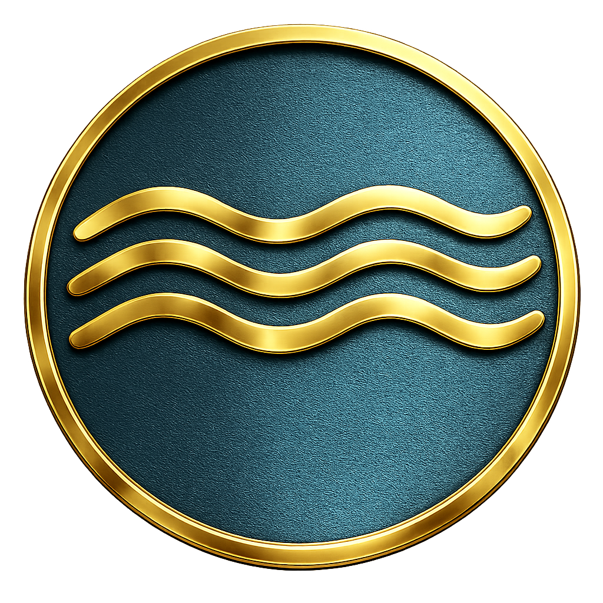

<!-- markdownlint-disable MD001 MD013 MD033 MD041 MD060 -->

<div align="center">



# Anclora Private Estates

### Bienes raíces de lujo en Mallorca

Marca ultra premium de real estate: exclusividad elevada a obra de arte, con presentación editorial de propiedades y experiencia multi-idioma.

**Español** · [English](./README.en.md) · [Deutsch](./README.de.md)

<br />


</div>

---

> [!IMPORTANT]
> Repositorio interno del ecosistema Anclora. No publicar detalles operativos, credenciales, datos reales de clientes ni lógica sensible fuera de canales autorizados.

## Qué es

Anclora Private Estates es la marca ultra premium de bienes raíces de lujo del ecosistema Anclora, centrada en Mallorca. Presenta propiedades exclusivas con una identidad visual oro/navy y tipografía editorial (Cardo + Inter + Fraunces).

## Categoría en el ecosistema

| Campo | Valor |
|---|---|
| Categoría | Ultra Premium |
| Acento de marca | `#D4AF37` |
| Tipografía | Cardo + Inter + Fraunces |
| Repositorio canónico | `anclora-private-estates` |

## Funcionalidades principales

- Presentación editorial de propiedades de lujo
- Animaciones de scroll e interacción (GSAP)
- Sistema de componentes accesible (Radix UI)
- Formularios validados (React Hook Form + Zod)
- Soporte multi-idioma (11 idiomas en producción)

## Stack tecnológico

| Área | Tecnología |
|---|---|
| Framework | Vite, React, TypeScript |
| Animación | GSAP |
| UI | Radix UI |
| Formularios | React Hook Form, Zod |
| Tipografía | Cardo, Inter, Fraunces |

## Arranque local

```bash
npm install
npm run dev
```

## Idiomas soportados

El producto en producción soporta 11 idiomas: Español (predeterminado), Català, Deutsch, English, Svenska, Français, Italiano, Dansk, Nederlands, Norsk, Português (`ULTRA_PREMIUM_LOCALES`, `src/lib/ancloraLanguageToggle.ts`).

Esta documentación se mantiene en ES/EN/DE.

## Documentación y gobernanza

- Contratos de marca y gobernanza: [`docs/standards/`](./docs/standards/)
- Bóveda Anclora (fuente de verdad): `contracts/` y `docs/governance/`

---

<div align="center">

### Anclora Group

Uso interno.

</div>
